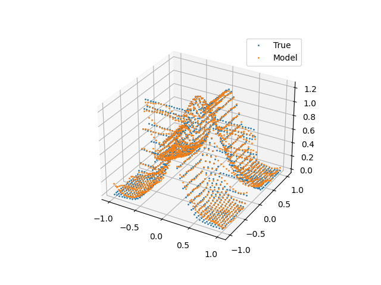

# regression

Implements linear regression and Sparse Spectrum Gaussian Process Regression (SSGPR) (Random Fourier Features).

Requires numpy and matplotlib.

Run `python regression.py` to see SSGPR test output on the famous cross 2D example from the LWPR paper [1].

[1] S. Vijayakumar, A. D’Souza, and S. Schaal, “Incremental Online Learning in High Dimensions,” Neural Computation, vol. 17, no. 12, pp. 2602–2634, Dec. 2005, doi: 10.1162/089976605774320557.
